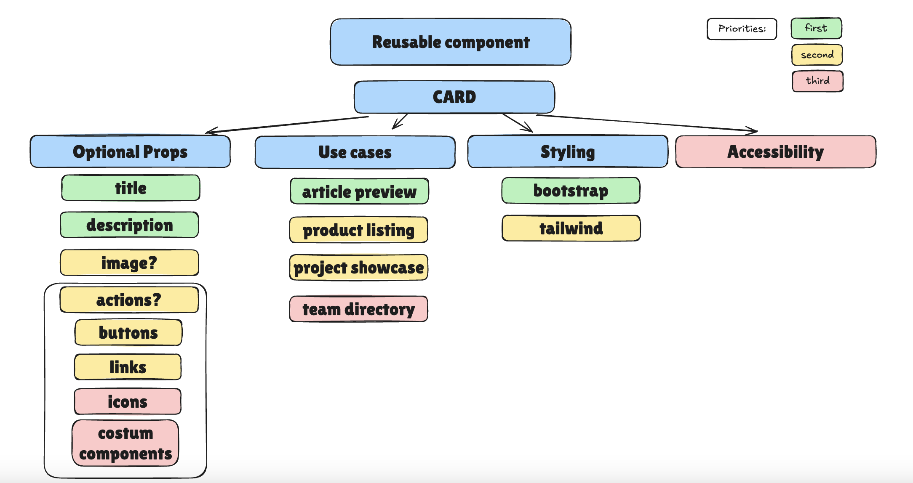

# Cardly

## A simple React application with a reusable component

This project was built for a half day assignment in School of Applied Technology. The main objective was to create a simple React application with a reusable component. 

## Big picture plan

My big picture plan:

## Project idea

I build a reusable card component library in React that displays different types of information (e.g., gallery card, product listing, project showcase, team directory). Each card should be customizable, supporting various layouts, themes, and interactive options. 

## Used concepts

* React (Vite)
* Tailwind (Daisy UI)
* Typscript

## Installation 

* Install with npm i
* Run it with  npm run dev

